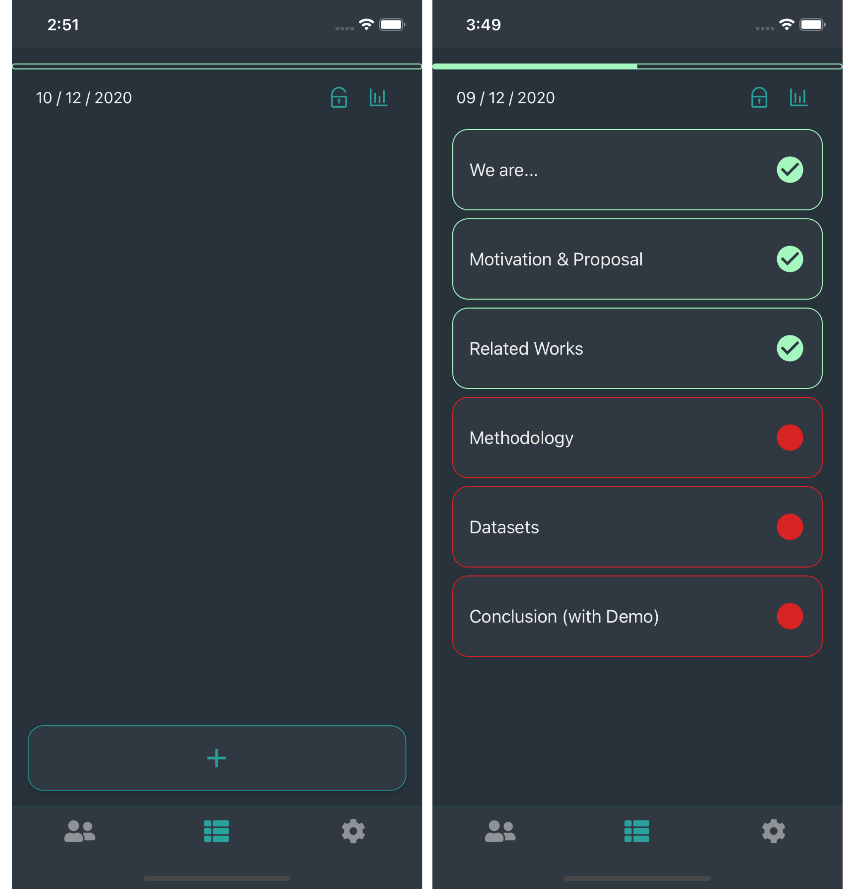
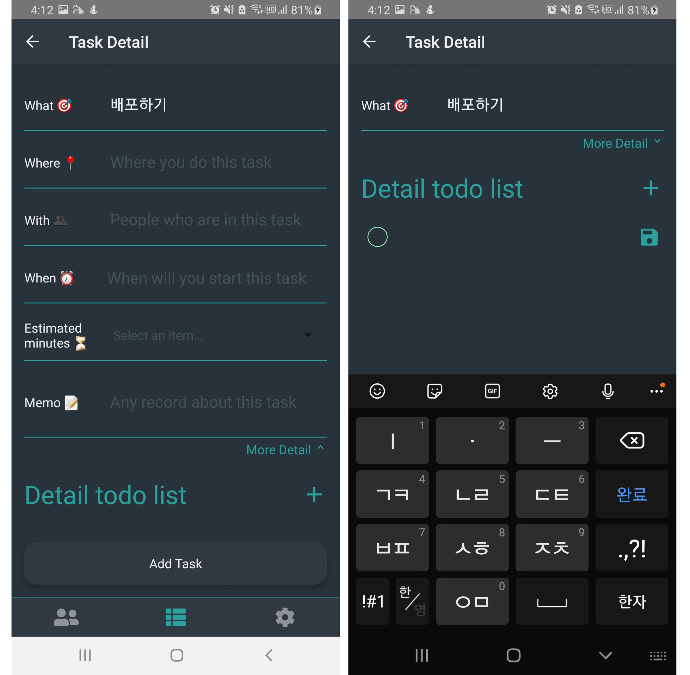
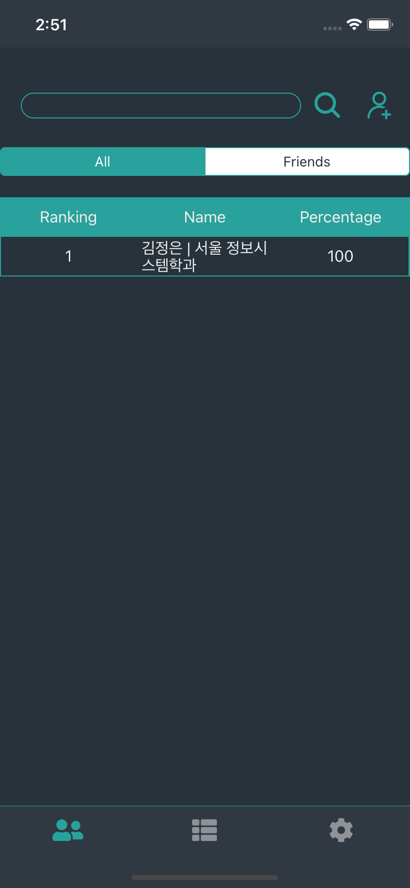

# Six Things Must TODO (STMT)

## 소개 💁🏻‍♂️

STMT는 사용자가 시간 관리와 매너리즘에서 벗어날 수 있도록 도움을 주는 **“Ivy Lee Method”**를 적용한 앱 기반 서비스다. 사람의 집중력과 작업 기억에는 한계가 있어 한 번에 여러 가지의 일을 하는 것은 사실상 불가능하다. 약 1 년 간 지속된 코로나 사태로 인해, 재택근무와 같이 휴식 공간에서 작업하는 사람들이 늘어나면서 업무와 휴식의 비효율이 증가하는 경우가 많아지고 있다. 이런 문제를 해결할 방법으로, STMT 애플리케이션에서 Ivy Lee Method 수행을 도와주도록 만들었다. 또한, 일의 집중을 위해 핸드폰을 멀리하는 사람들도 있다는 점을 고려하여 핸드폰을 사용하지 않고도 NUGU 인공지능 스피커로 업무 관리를 할 수 있도록 설계하였다.

## 배경 및 동기❗️

### **문제 인식 및 분석 🔎**

현대 사회는 과거보다 같은 시간 간격 동안 더 많은 일을 할 수 있는 기술과 능력이 있다. 실제로 현대인들은 더 많은 업무를 분담하게 되고, 이에 따라 여러 업무에 동시에 신경을 분산하게 된다. 인간이 동시에 여러 일을 처리할 수 있는 능력이 있었으면 좋겠지만, 인간의 집중력, 작업 기억의 한계로 인해 멀티 태스킹을 실제로 실현하기는 어렵다. 평소 멀티 태스킹을 많이 하는 것이 과제 전환 능력<small>\*1</small>에 도움을 주지 않고 오히려 부정적인 상관이 있음을 보여주는 연구<small>\*2</small>도 있다. 또한, 많은 업무 가운데 어떤 업무의 우선순위가 더 높은지 고민하지 못하고 우왕좌왕하는 현상도 발생한다.

복잡해지는 현대 업무의 특성과 별개로, 최근 1년간 지속되는 COVID-19 사태로 인해, 사람들의 업무 공간과 휴식 공간 사이의 붕괴가 발생하고 있다. 즉, 휴식하던 공간에서 업무를 지속해야 하는 경우가 많이 생겼는데, 상황이 길어질수록 업무와 휴식 사이의 경계가 모호해지면서, 업무의 효율성과 휴식의 만족감 모두 떨어지는 현상이 발생하고 있다.

위와 같은 이유로 현재 효율적인 업무 관리는 점점 어려워지고 있다. 우리는 업무의 효율성을 올리기 위해서, 우선순위에 집중한 단일 태스크 처리 능력을 향상할 필요가 있다고 분석했다. 복잡한 업무를 우선순위로 정렬하고, 지금 당장 할 수 있는 일에 집중하는 방식으로 복잡성을 단순화하고, 집중력을 높여 업무 중인 상황과 아닌 상황을 확실히 구분할 수 있게 해야 한다.

> <small> *1 진행 중인 업무를 중단하고, 전환하는 행동 </small>

> <small> *2 National Academy of Sciences of the United States of America, 2009 </small>

### 해결 방안 🛠

위와 같은 문제를 해결하는 유명한 방법 중 하나가 **Ivy Lee Method**이다. Ivy Lee Method는 다음 다섯 가지 단계로 현재 집중해야 할 태스크를 지정하고 해결해 나가도록 유도한다.

1. 하루 일과가 끝나면 다음 날 해야할 일을 정한다 (최대 6가지)
2. 일에 대한 우선순위를 매기고, 그에 따라 정렬한다.
3. 다음 날이 되면 우선순위 순서대로 일을 실행한다. 이 첫 번째 할 일이 끝날 때까지 다음 일로 넘어갈 수 없다.
4. 하루 동안 정했던 일들을 모두 마치지 못 했다면, 다음 날 해야할 일에 포함시키고 1, 2, 3 단계를 수행한다.
5. 이 방법을 매일 반복한다.

이 방법은 아주 간단하면서도 강력하다. 일의 순서를 강제해 단일 업무에 집중할 수 있게 만들고, 다른 일을 살펴보느라 시간을 뺏기는 일이 없도록 도와준다. 또한 아주 간단해서 누구든 이 방법을 실천할 수 있다. 이 방법을 직접 Ivy Lee에게 컨설팅 받은 것으로 유명한 철강 회사의 대표 Charles M. Schwab은, 이 방법을 3개월 동안 회사에 적용 후, 현재 가치로 40만 달러에 해당하는 비용을 지불했다. 

우리는 이 방법을 수행하도록 강제하는 애플리케이션과, NUGU 인공지능 스피커를 접목해 현대인의 자기 관리를 돕는 서비스를 개발했다. 애플리케이션을 이용해 업무를 설정하고, NUGU 스피커를 통해 업무 확인 및 완료를 시킬 수 있어서 업무 중 휴대폰을 사용하지 않고도 업무 관리를 쉽게 할 수 있다.

## 사용법 🚀

### 어플리케이션 📱

1. **로그인**

구글 계정을 사용하여 로그인한다. (최초 1회)

**2.1 메인 화면**

하단 플러스 버튼을 눌러서 업무를 추가한다. 업무 작성 후 진행 순서를 바꾸고 싶다면 손으로 잡아 끌면 된다. 자물쇠 버튼을 누르면 당일 설정한 태스크가 진행되고 다음 업무로 넘어가려면 반드시 완료해야한다.

**2.2 태스크 설정 화면**

업무를 설정할 때 장소, 친구, 시작시간, 소요시간, 메모, To Do List 등 세부사항도 같이 설정할 수 있다. 

**2.3 기록 확인**

메인 화면 우측 상단 그래프 버튼을 누르면 날마다 설정한 업무와 완료율을 확인 할 수 있다. 이 완료율은 소셜 화면에서 순위를 매길 때 사용된다.

**3.1 소셜 화면**

친구 리스트와 순위를 확인할 수 있다. 순위는 완료율에 따라서 결정된다.

**3.2 친구 추가**

소셜 화면 우측 상단 플러스 버튼을 누르면 친구 추가 화면이 뜬다. 친구가 가입한 구글 이메일 주소를 검색하면 친구를 찾아서 추가할 수 있다. 팔로잉 탭으로 자신이 추가한 친구 목록을, 팔로워 탭으로 사진을 추가한 친구 목록을 확인할 수 있다.

1. **태스크 관련 설정**

알람 시간을 설정하면 매일 설정한 시간에 사용자에게 업무 작성을 하라고 상기시켜준다.
업무 잠금 시간을 설정하면 설정한 시간안에 계획한 업무를 모두 수행해야한다. 이 시간 안에 수행된 업무는 대시보드에 기록된다.

### NUGU 인공지능 스피커 🔊

## 결과물 🗂

### Overall

### Code Repository
- [Core Backend](https://github.com/6-things-must-to-do/backend)
- [Client](https://github.com/6-things-must-to-do/app)
- [NUGU Proxy Backend](https://github.com/6-things-must-to-do/proxy)

### Presentation & Demo
  
[Presentation PDF](./pdf/presentation.pdf)  

### 블로그 (NUGU 인공지능 관련 기술)

[Six Things Must TODO](https://6-things-must-to-do.github.io/docs/about/)

### Documentation
- [Documentation PDF](./pdf/STMT.pdf)
- [LaTex](./tex/6%20things%20must%20to%20do.tex)