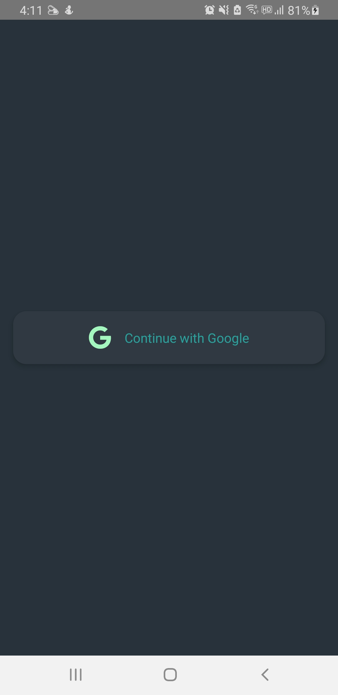
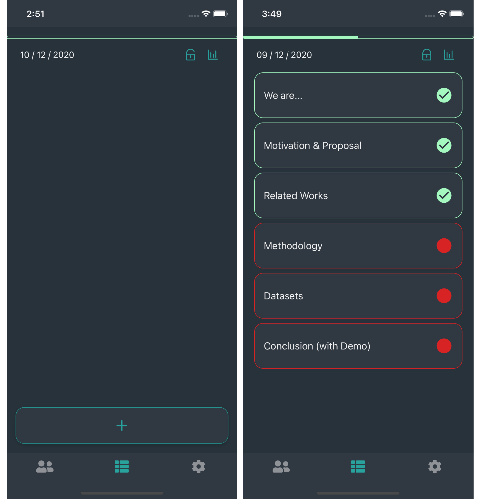
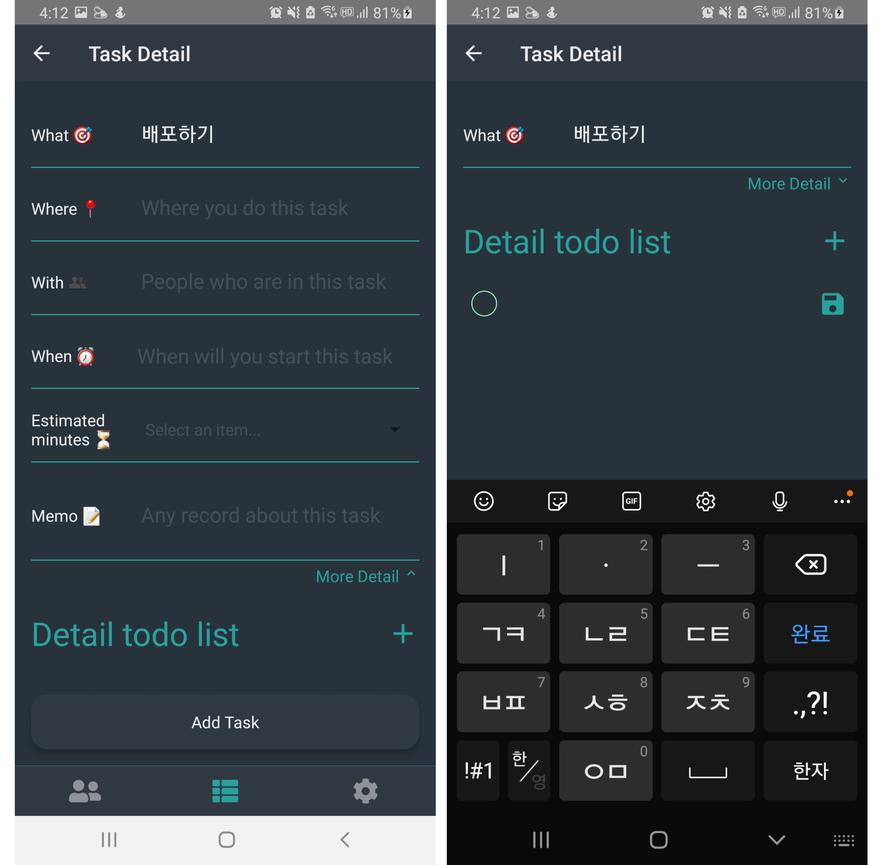
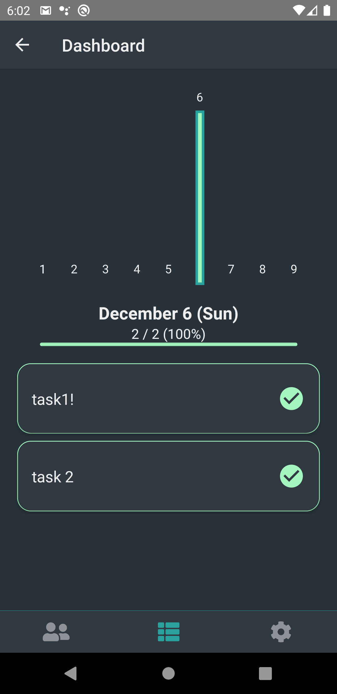
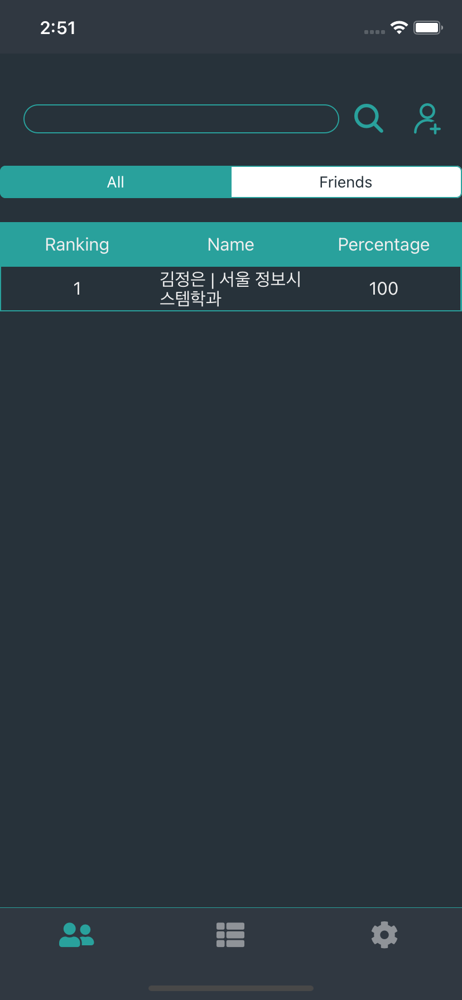
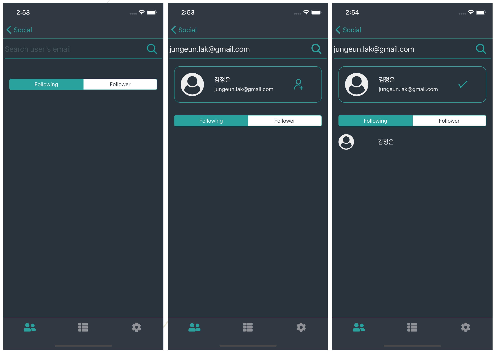
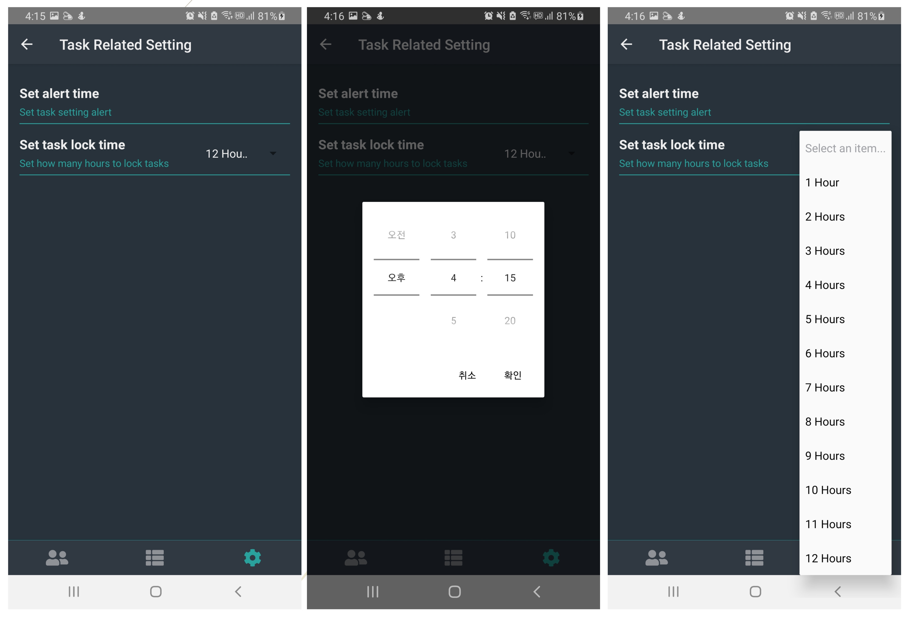

### 1. 로그인

구글 계정을 사용하여 로그인한다. (최초 1회)

### 2.1 메인 화면

하단 플러스 버튼을 눌러서 업무를 추가한다. 업무 작성 후 진행 순서를 바꾸고 싶다면 손으로 잡아 끌면 된다. 자물쇠 버튼을 누르면 당일 설정한 태스크가 진행되고 다음 업무로 넘어가려면 반드시 완료해야한다.

### 2.2 태스크 설정 화면

업무를 설정할 때 장소, 친구, 시작시간, 소요시간, 메모, To Do List 등 세부사항도 같이 설정할 수 있다. 

### 2.3 기록 확인

메인 화면 우측 상단 그래프 버튼을 누르면 날마다 설정한 업무와 완료율을 확인 할 수 있다. 이 완료율은 소셜 화면에서 순위를 매길 때 사용된다.

### 3.1 소셜 화면

친구 리스트와 순위를 확인할 수 있다. 순위는 완료율에 따라서 결정된다.

### 3.2 친구 추가

소셜 화면 우측 상단 플러스 버튼을 누르면 친구 추가 화면이 뜬다. 친구가 가입한 구글 이메일 주소를 검색하면 친구를 찾아서 추가할 수 있다. 팔로잉 탭으로 자신이 추가한 친구 목록을, 팔로워 탭으로 사진을 추가한 친구 목록을 확인할 수 있다.

### 4. 태스크 관련 설정

알람 시간을 설정하면 매일 설정한 시간에 사용자에게 업무 작성을 하라고 상기시켜준다.
업무 잠금 시간을 설정하면 설정한 시간안에 계획한 업무를 모두 수행해야한다. 이 시간 안에 수행된 업무는 대시보드에 기록된다.
